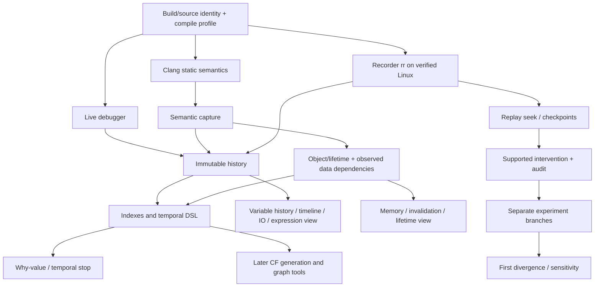

# phantom: передача backend-разработчику

Дата актуализации: **27 сентября 2026**. Этот документ — основной вход для отдельного backend-агента и полный реестр согласованных направлений phantom. Приоритет — необычный, глубокий **однопоточный** учебный debugger: история исполнения, вычисления, время жизни объектов, запросы к прошлому, replay/what-if и память. CF/stress-инфраструктура, специальные графовые представления, широкая многопоточность и обучение модели русского языка остаются в программе, но выполняются позже.

Основной backend: **отдельный процесс на Linux, C++20**, Clang/clangd, адаптер rr/GDB; нативный LLDB — дополнительный адаптер macOS. Существующие React/TypeScript, Electron и Three.js можно использовать выборочно: backend не зависит от текущей реализации интерфейса. Разработка интерфейса на Mac не требует переезда всей рабочей системы на Linux. Развёртывание описывает [`docs/LINUX_BACKEND.md` в ветке `backend/linux`](https://github.com/Tigersmechom/Phantom/blob/backend/linux/docs/LINUX_BACKEND.md), состояние service и команды сборки — [`backend/README.md` в той же ветке](https://github.com/Tigersmechom/Phantom/blob/backend/linux/backend/README.md). Эти файлы доступны локально после checkout `backend/linux`; в `main` их может не быть. Текущий GDB engine не означает готовность recorder rr или подключение UI.

Версия существующих DTO: **1**, [`src/backend-contract.ts`](../src/backend-contract.ts). Это **контракт будущей интеграции**, а не уже подключённый backend или новый доступный `window` API. Разделы 3–8 сохраняют точные инварианты v1; последующие разделы определяют программу и предлагаемые расширения. Пока изменение не внесено в DTO, runtime-валидаторы и fixtures, оно не является новым wire API. Использовать совместимую часть v1 независимо; необходимые общие изменения выносить отдельным patch с причиной, продолжая работу без ожидания необязательного подтверждения.

## Порядок работы — кратко

Полные зависимости, исследования и критерии приёмки приведены в [разделе 13](#13-приоритетная-программа-p0p10). Порядок отражает приоритет продукта; независимые прототипы можно исследовать параллельно.

| Очередь | Результат |
| --- | --- |
| P0 | Минимальное реальное исполнение, идентичность сборки, границы протокола и проверка Linux/rr |
| P1 | Неизменяемая история, счётчик, навигация и история значений |
| P2 | Наблюдаемые вычисления, аргументы/результаты, время жизни и учебная семантика C++ |
| P3 | История как база данных, temporal breakpoints и типизированный DSL |
| P4 | Запись/повтор, обратное исполнение, контрольные точки и экономное хранение |
| P5 | Вмешательства, альтернативные будущие, вариации и сравнение запусков |
| P6 | Карта памяти, инвалидирование, сбои и исключения |
| P7 | Происхождение значений, чувствительность результата, стоимость и сравнение оптимизаций |
| P8 — позже | Codeforces, генераторы тестов, stress и уменьшение контрпримеров |
| P9 — позже | Графы, структуры данных и специальные 3D-представления |
| P10 — позже | Многопоточность и перевод русского языка в DSL |

Сохранить все направления из реестра идей. Сначала получить проверяемое ядро исследования исполнения; обычная IDE-инфраструктура служит этому ядру и не должна вытеснять его на неопределённый срок.

## 1. Что уже работает

phantom — Electron-приложение с React/TypeScript и отдельным Three.js-представлением кода. Запуск: `Start.command` или `release/phantom-darwin-arm64/phantom.app`; архив приложения — `release/phantom-macOS-arm64.zip`.

| Сейчас реализовано | Граница |
| --- | --- |
| Файлы/проект, сохранение, защита несохранённого исходника | `electron/main.cjs`, `project-service.cjs`, `preload.cjs`, `src/native.ts` |
| Basic: настоящие compile/run, stdin → EOF, stdout/stderr, stop | `window.frameNative.compile/execute/stopExecution`; компилятор через `spawn`, без shell, cwd проекта |
| `.frame/build.json` | `version:1`, `compiler`, `flags:string[]`, `outputDirectory`; в UI только флаги, один аргумент на строку, autosave при blur/закрытии |
| Настоящий PTY | `terminal.open/write/resize/restart`, xterm; скрытие сохраняет сессию, restart завершает старую оболочку и дочерние процессы |
| Debug-пример | `src/demo.ts`: 57 подготовленных кадров только `DEMO_SOURCE`; исходный код пользователя этим механизмом не исполняется |
| Наблюдение значений/выражений в UI | Сейчас готовые demo-данные, анимации, история, позиции камеры; это не наблюдения процесса |
| Hover ASM и breakpoint в редакторе | Демонстрация; настоящий ASM и остановки ещё не подключены |

В ветке `backend/linux` реализован самостоятельный **C++20 service с GDB/MI**:
сборка неизменяемого snapshot исходников, запуск, шаги, breakpoints, стек/значения,
чтение памяти/ASM, ограниченная история наблюдений и replay транспортных событий.
Это реальные наблюдения процесса; recorder rr и trace выражений ещё не подключены.
`--self-check` сообщает `ready` и `v1-stdio-ndjson`; работоспособность engine
проверяют интеграционные тесты с GDB, а не сам статус CLI.

Текущий checkpoint закрывает три задачи: устойчивость lifecycle/отмены и очистку
после сбоев; отдельный pipe-wrapper для точного stdin → EOF и независимых stdout/
stderr; проверку реальных wire DTO против frontend `5630853`. Покрыты таймаут,
смерть GDB, отключение клиента, управляющие команды в одном пакете с исполнением,
длинный ввод, управляющие байты, усечение потоков и невалидный UTF-8 вывода.
Frontend целиком переносить не требуется; адаптер приложения и native bridge
остаются отдельной работой. Подробности и воспроизводимые команды:
[backend/README.md](../backend/README.md) и
[frontend-compatibility.md](../backend/docs/frontend-compatibility.md).
Этот checkpoint не означает завершение всей программы P0–P10 ниже.

Сохраняем бренд **phantom**, но не переименовываем совместимые внутренние `window.frameNative`, `FRAME_*` и `.frame/build.json`. Старый профиль FRAME переносится в phantom без перезаписи имеющихся настроек. Не ломать защиту close/reload, сохранение флагов перед сборкой и изоляцию IPC.

Текущий native Basic ограничивает сборку/запуск 120 секундами и вывод 4 МиБ. Это существующие ограничения Basic; новый backend должен объявлять свои фактические limits через capabilities. Старый `/Users/123/Desktop/my_idle` не изменять. Его `ARCHITECTURE.md` — полезный проект архитектуры, но вводный статус «не реализовано» устарел: `src/shared/types.ts` и `src/electron/preload.ts` уже описывают настоящий `window.debuggerApi`.

## 2. Чего нельзя обещать на основании LLDB

Пользователь хочет видеть отдельные объявления, ввод, вычисления и вызовы, в том числе `int n;`. **Обычного source stepping недостаточно, чтобы гарантировать каждую такую операцию.** У объявления без инициализации может не быть инструкции или собственной записи в line table. Даже `-O0` не даёт взаимно однозначного соответствия «строка → остановка → завершённая операция».

Настоящая остановка сообщает PC перед следующей инструкцией; отличие двух снимков показывает изменения между остановками. Завершение выражения, все чтения stdin и порядок вложенных вызовов требуют подтверждённых дополнительных данных — например, инструментирования/семантического trace с сохранением поведения программы. Не подставлять подготовленные demo-события, не создавать остановки по регулярным выражениям, не вызывать функции повторно ради получения красивого результата.

Для первого настоящего backend допустимы реальные GDB/LLDB step over/into/out и честно ограниченные capabilities. Однако это только основание: приоритетная программа ниже включает семантическое наблюдение Clang и recorder rr, а не заканчивается обычной обёрткой LLDB. Если выражения или точные чтения stdin не наблюдаются, соответствующие overlays выключены. Полный режим «каждая операция» — отдельная возможность с fixtures, coverage и объяснением границ. Даже определение операции необходимо согласовать: source statement, операция C++ и машинная инструкция — разные единицы.

## 3. Контракт и транспорт

`DebugBackendAdapter` предлагает `connect`, `request`, `subscribe`, `dispose`. `connect({supportedProtocolVersions:[1]})` согласует версию и выдаёт capabilities, идентичность открытого workspace, согласованные state/observation и `throughSequence`. Типы standalone, без React/Electron-зависимостей. Они не заменяют runtime-валидацию входящего JSON.

Frontend вызывает **subscribe до connect** и временно буферизует события. Backend фиксирует state/observation/throughSequence одним согласованным checkpoint. После connect frontend принимает его контекст, устанавливает checkpoint, затем применяет только события этого контекста с sequence выше checkpoint. Это закрывает гонку первой подписки даже при `eventReplay:false`. При последующем пропуске и отсутствии replay используется такой же согласованный `getState`, не молчаливое продолжение с дырой.

`getState` не восстанавливает потерянный `commandFinished`. При `eventReplay:false` frontend завершает ожидание затронутого запроса локальной ошибкой `EVENT_GAP` с неизвестным исходом, останавливает автоматические шаги и не повторяет мутацию. Следующее действие допускается только после синхронизации текущего состояния и проверки допустимой phase/stop; успешное чтение state не объявляет прежнюю команду успешной. Если нужна достоверная история исходов команд, backend должен поддержать replay событий или отдельный согласованный lookup статуса запроса.

Каждый запрос несёт `protocolVersion`, уникальный `requestId`, `workspace:{id,revisionId}`, `session:{id,generation}|null` и команду. `expectedStop:{stopId,stateRevision}` обязателен для stepping, мутаций, live handles, чтения памяти/переменных в остановленном процессе. Backend проверяет контекст и остановку атомарно, а не после выполнения действия.

| Команды | Семантика |
| --- | --- |
| `capabilities`, `build`, `launch`, `getState` | Согласование возможностей, конкретный артефакт и состояние процесса |
| `step`, `continue`, `pause`, `stop` | Управление настоящим процессом; состояния подтверждаются событиями |
| `listHistory`, `readHistory` | Пагинация и чтение сохранённых наблюдений; процесс не перемещается |
| `restoreExecution` | Отдельное восстановление через проверенный replay, только при поддержке |
| `setBreakpoints` | Полная замена набора для конкретной ревизии документа; ответ содержит verified/resolved location |
| `readVariables`, `writeVariable` | Ограниченное чтение/запись с проверкой остановки и повторным чтением после записи |
| `disassemble`, `readMemory` | По capability, с явными лимитами и принадлежностью артефакту/остановке |
| `cancel`, `replayEvents` | Отмена конкретного request и восстановление пропущенных транспортных событий |

Ответ `accepted` означает принятие долгой операции; для launch используется отдельный `launchAccepted`. Backend назначает session ID/generation до первых событий inferior и возвращает их в result и envelope response; `launchAccepted.throughSequence` равен 0, события новой сессии начинаются с 1. Frontend принимает новую session только по ответу ожидаемого launch request для актуального workspace. Если её события пришли раньше ответа, они временно буферизуются по `causedByRequestId`; неподтверждённый чужой контекст не применяется. Ошибка launch после принятия завершает назначенную сессию явно.

Для каждого принятого request нужен ровно один терминальный `commandFinished` (`completed`, `cancelled`, `failed`); до него публикуются относящиеся к операции state/observation. Ошибка до принятия возвращается через `ok:false`; закрытие транспорта обрабатывается как потеря соединения, а не успешная команда. Ответы на чтение, build и capabilities могут сразу содержать результат. `dispose` отписывает обработчики и освобождает принадлежащие адаптеру ресурсы; политика остановки inferior при закрытии приложения остаётся явной.

Capabilities объявляют реальные архитектуры, виды шага, поддержку breakpoint/условий, записи значений, history/replay, input tracking, expression groups, ASM и памяти. Неподдержанные действия возвращают `UNSUPPORTED`. `null` session допустима для запросов/событий до запуска, например сборки.

Существующий preload остаётся узким: никакого raw IPC, прямого доступа renderer к Node, произвольных команд LLDB/shell. Новый bridge/adaptor добавляется отдельным путём после review контракта. Проверять owning window/main frame, пути и принадлежность workspace так же, как в текущем main.

## 4. Версии, порядок событий и отмена

- Workspace revision меняется при смене проекта. Новая сессия/поколение отделяет предыдущий запуск; каждый реальный inferior имеет собственный `processInstanceId`, в том числе кандидат replay. События несут эту принадлежность; поздний stdout/input прежнего inferior не обновляет восстановленный процесс.
- Исходник — `SourceBundleDTO` с точными текстами, document/revision IDs и SHA-256 UTF-8. Build фиксирует bundle, конфигурацию, compiler/version, полную команду, target triple, архитектуру и hash бинарника. Нельзя брать «текущий текст редактора» для старой истории.
- События имеют возрастающий `sequence` в пределах workspace revision + session generation. Дубликаты игнорируются; при пропуске — ограниченный буфер и `replayEvents` либо `getState` с `throughSequence`. Нельзя применять позднее событие старого поколения к новому проекту. Порядок доставки не заменяет порядок исполнения.
- Ответы сопоставляются по request ID и контексту; результаты старых hover/чтений отбрасываются. Отмена не отменяет уже произошедшие побочные эффекты: после неё нужен подтверждённый state. `cancel` конкретного запроса, `pause` процесса и `stop` сессии — разные действия.
- Одновременно разрешена максимум одна изменяющая исполнение команда; контрольные `cancel/pause/stop` имеют отдельный путь прерывания. UI со скоростью **0,25–12 операций/с** отправляет следующий step только после предыдущего подтверждения, без накопления очереди «догоняющих» шагов. Анимация не является подтверждением остановки.
- Перед сменой проекта завершить/отменить привязанное к нему сохранение флагов. Не переносить поздний save-response или flags draft в новый `.frame/build.json`. Перед build дождаться текущего autosave; при его ошибке не собирать молча со старыми флагами.

Ошибки структурированы (`STALE_CONTEXT`, `STALE_STOP`, `BUSY`, `BUILD_FAILED`, `TIMEOUT`, `CANCELLED`, `REPLAY_DIVERGED`, `HISTORY_EVICTED`, `LIMIT_EXCEEDED` и другие из DTO). Сохранять понятное сообщение/диагностику; ошибка не должна оставлять spinner или скрытый процесс навсегда.

## 5. Снимки, история и настоящий replay

`DebugSessionStateDTO.live` описывает живую позицию. `ExecutionViewDTO` — отдельно принадлежащий frontend курсор `live/history`. `StopObservationDTO` неизменяем и содержит точку `branchId + eventOrdinal`, stop/state revision, build/source identity, стек, значения, input/output и coverage. Изменение переменной на той же остановке увеличивает `stateRevision`; одинаковая строка не означает одинаковый шаг.

Исторические недозахваченные значения нельзя дочитывать из текущего inferior. Возвращать `not-captured`/ошибку вытеснения, не подменять их новыми данными. Стек/локаторы включают активацию и область; одинаковое имя, адрес или числовое значение не доказывают тождественность объекта. DAP handles действуют только в своём процессе/остановке.

Для одной и той же точки истории снимок при переходе вперёд, назад и повторном открытии должен совпадать целиком: типы, доступность, значения, области, аргументы, ввод и вывод. Отсутствующее значение не заменяется нулём при загрузке, мерже delta, восстановлении или анимации. Обратно через объявление/выделение контейнера возвращается исходное `not-declared`/другая зафиксированная причина; после подтверждённой нулевой инициализации нули остаются нулями в обоих направлениях. Сравнивать point/stop revision, а не только одинаковую строку исходника.

По умолчанию инспектор показывает **текущую активацию и её действующие lexical scopes**, включая параметры функции. Внутри `add(a,b)` видны `a` и `b`; `n`, `i`, `values`, `prefix` из вызывающей `main` не становятся локальными `add` и автоматически не смешиваются с ними. Caller frame можно показать только после явного выбора кадра стека, с его собственной подписью и snapshot identity. Вышедшие из области переменные не остаются среди активных locals. Использовать уже предусмотренные `StackFrameDTO.activationId` и `VariableDTO.scopeId/activationId`; не фильтровать реальные значения по именам функций или строковым догадкам.

Различать четыре действия: **чтение сохранённого снимка**, **seek внутри recorder-backed replay**, **проверенный повторный запуск** и **новое what-if продолжение**. v1 `restore:'verified-replay'` — минимальная capability, а не обещание единственного механизма. Для rr восстановление следует его журналу и checkpoints; для ограниченного rerun нужен запуск того же бинарника, stdin, argv, управляемого окружения и cwd с повторением подтверждённого журнала. Проверять стек, позицию и доступные значения на контрольных точках; явно перечислять непроверенное покрытие. При расхождении — `REPLAY_DIVERGED`, а не «почти восстановлено».

Продолжение из прошлого с изменением данных/ветви — отдельная исследуемая возможность. Детерминированный replay прежней истории сам по себе её не гарантирует. Если backend способен создать такое продолжение, оно получает новую ветку, а прежнее будущее сохраняется. Для первого ограниченного what-if допустим отдельный rerun до проверенной точки вмешательства. Файлы/сеть/часы/случайность/несколько потоков не считать поддержанными без отдельной стратегии. Не запускать replay как скрытый побочный эффект простого hover или просмотра истории.

## 6. Значения и геометрия исходника

`RuntimeValueDTO` различает available и unavailable с причиной: `not-declared`, `uninitialized`, `not-captured`, `out-of-scope`, `optimized-out`, `read-error`, `truncated`, `unsupported`. **Uninitialized допустимо лишь при подтверждении**; сырые байты стека сами по себе не доказывают корректное значение или инициализацию.

Целые передаются десятичными строками с разрядностью/знаком. `18446744073709551615` нельзя пропускать через `Number`, `parseInt` или JSON-number. IEEE float NaN/±Infinity/−0 имеют отдельную classification и строковое представление; они не являются unavailable. Текущий inspector для `null` рисует «NaN» как визуальную заглушку demo, но новый presenter обязан сохранять различие причин и настоящего IEEE NaN. Известные нули в `vector<int>(n)` и `vector<int>(n + 1, 0)` остаются нулями.

Существующий `ExpressionStage` из `execution-types.ts` уже принимает `number|string|null`, чтобы renderer мог показать точные строки. Это presentation-модель: будущий presenter преобразует структурированное значение в строку/подпись, **не вычисляет выражение** и не сужает число. `RuntimeValueDTO` и `ExpressionTraceDTO` пока не подключены к native bridge автоматически.

`operandLabels` в presentation-событии обозначают соответствующие операнды и совпадают по порядку с `operands`/`operandRanges`. В demo они берутся из известных точных фрагментов исходника; для backend — из предоставленных имён/диапазонов. `resultKind:'boolean'` разрешает отображение подтверждённого логического результата как true/false; в demo это только известное сравнение целых `i < n`. Для произвольного C++ тип результата, включая перегруженные операторы, сообщает backend. Нельзя выводить имя переменной, тип, оператор или порядок вызова только из числового значения или формы записи.

Все source ranges относятся к конкретной ревизии: нулевые UTF-16 offsets `[start,end)`, а line/column — с 1, колонка тоже в UTF-16, конец исключён. Обе формы должны согласоваться. Backend переводит byte columns DWARF/Clang в эти координаты по сохранённому тексту; учитывать CRLF, tabs, emoji и combining symbols. Не нормализовать Unicode/переводы строк; UTF-8-передача требует валидного Unicode, одинокие суррогаты отклонять как `INVALID_REQUEST`. Диапазоны не должны разрезать surrogate pair.

`ExpressionTraceDTO` содержит подтверждённые операции, операнды/результат, зависимости и source spans. Группы задаёт backend. `observed-after` означает подтверждённую связь с предыдущей группой; `not-established` и несколько stages внутри группы не задают внутреннего порядка. Для `f() + g()`, нескольких `cin >>` и цепочек вызовов нельзя из левого положения в тексте заключать порядок исполнения. Показывать только наблюдённое; не восстанавливать промежуточный результат из итогового значения.

Trace ID отличает конкретное выполнение, включая итерацию/активацию; stage/group IDs уникальны внутри trace и стабильны при его повторном показе. Каждый `dependsOn` ссылается на существующий stage того же trace, без self-reference/циклов. DAG описывает подтверждённую зависимость значений, не лексический порядок AST. Первая группа имеет `not-established`; `observed-after` допустим лишь при evidence, что операции группы произошли после предыдущей. Для неизвестных отношений не создавать «удобный» порядок. Валидатор отклоняет дубли IDs, висячие ссылки и циклы.

Три текущих варианта 3D-подачи используют одни данные: `float` — **«Над выражением»**, `rail` — **«На полях»**, `inline` — **«В плоскости»**. Frontend отвечает за геометрию/длительность; backend не присылает пиксели, CSS или анимационные команды. `demo.ts` содержит точные статические ranges известных выражений; это не анализатор произвольного C++.

## 7. STDIN: отображение не равно разбору C++

`SubmittedInputDTO` содержит **ID и точный text**, encoding UTF-8 и **`closeAfterWrite:true`**. В протоколе v1 только фиксированный stdin: append/интерактивного дописывания пока нет. `false` не является поддержанным запросом и отклоняется; будущий interactive input потребует новой согласованной capability и команд append/close. Waiting может наблюдаться до доставки подготовленных данных, но UI v1 не обещает продолжить ввод в уже закрытый pipe.

`InputTrace.revision` для совместимости с текущим `InputPanel` означает **саму точную строку text, не ID и не hash**. Это намеренно названное исключение; настоящий ID — `submitted.id`. `InputPanel` отображает диапазоны только если editable value дословно равен trace.revision. Изменение поля не меняет уже отправленный input/историю.

`consumedRanges`/`activeRange` — нулевые UTF-16 `[start,end)` в этой строке. Диапазоны могут охватывать известные прочитанные токены, не утверждая, что всё остальное прочитано. `consumedThroughUtf16` — отдельный подтверждённый курсор, если backend его знает. Диапазоны валидируются, не выходят за строку и не режут surrogate pairs. Пишущий в pipe backend знает `deliveredBytes`; это **не** число байтов, фактически извлечённых `std::cin`, и не основание красить токены.

| Ситуация | Честное состояние |
| --- | --- |
| Чтение ещё не начиналось | trace `idle`; не путать с неизвестным значением переменной |
| Extractor ждёт данные | `waiting`; если конкретный следующий диапазон неизвестен, activeRange отсутствует |
| Подтверждённое извлечение | `reading` + реальные диапазоны/lastRead; назначения значений наблюдаются отдельно |
| Parse fail | `error`, lastRead `parse-error`, реальные fail/eof/bad flags; не красить неуспешный токен как успешно присвоенный |
| EOF | lastRead `eof` и наблюдённые stream flags; EOF не равен parse fail, доставке всего pipe или UI `complete` |
| Все известные чтения завершены | trace `complete`; само по себе не доказывает EOF и не окрашивает trailing whitespace |
| Нет точного наблюдения stdin | tracking `none`/`transport-only`, trace `null`; подсветки потребления нет |

Не считать число остановок, номер строки или длину stdout счётчиком чтений. `cin >> a >> b` может дать несколько извлечений на одной строке, fail после первого, повторный вызов, `clear()`, `seekg`, `getline` после числа и прочие отличия. Учитывать locale, skipws и фактически съеденные разделители. JavaScript `\s` не определяет whitespace правила конкретного C++ stream; Unicode whitespace, многобайтные символы и UTF-8↔UTF-16 требуют fixtures. Отдельно фиксировать неуспешный read: конечное значение назначения нельзя угадывать по правилу «всегда не меняется» или «всегда ноль».

Текущий `demoInputTrace(step, submittedInput)` обслуживает **только подготовленный пример** и его проверенный формат шести чисел, сохраняет исходные пробелы и подсвечивает заданные token ranges. Он не моделирует locale/stream flags настоящего `cin`. PTY-терминал — независимая системная оболочка и не источник этих debugger input events.

## 8. Архитектура, breakpoint, ASM и ограничения

ARM64/x86-64 выбираются при сборке; смена архитектуры, исходника или флагов инвалидирует возможность продолжать старую сессию как новую. Сохранённая история остаётся связанной со старым артефактом. Новый запуск требует подходящего бинарника/символов; не перекрашивать старый ASM под новую архитектуру. Обнаруживать доступность toolchain/выполнения, не предполагать Rosetta или поддержку DAP по одному факту успешной компиляции.

Breakpoint содержит ревизию и requested range; backend возвращает verified и фактическую location либо причину отказа. Пустая строка/декларация/комментарий может не иметь адреса. Условия и hit count — только по объявленным возможностям. Для ASM различать запрос около настоящего PC и по source/DWARF range; старый backend отдаёт ограниченный участок около PC и не доказывает поддержку произвольного hover. Hover на секунду — frontend задержка, а не повод заранее выполнять процесс.

Объявлять лимиты вывода, истории, resident snapshots, страниц переменных, строк, памяти, инструкций, command/replay timeout. Все объёмы ограничены до выделения памяти; большие контейнеры читаются страницами. Показывать truncation/eviction и coverage. Снимки без сохранённой памяти не обещают полный memory replay. После stop, отмены, перезапуска терминала и выхода не оставлять inferior, LLDB/DAP или дочерние процессы. Не трогать процессы вне своей сессии.

## 9. Целевая архитектура и продуктовые границы

Это программа разработки, **не перечень уже работающих функций**. Качество и полнота объяснения небольших программ важнее первоначальной экономии CPU/GPU/RAM. Тем не менее каждый запуск имеет явные бюджеты: бесконечный цикл, огромный контейнер или испорченный размер не могут бесконтрольно исчерпать машину.

| Слой | Ответственность и граница |
| --- | --- |
| Editor intelligence | Старт с clangd: completion, navigation, diagnostics, symbol/type information для точной compile command. Исследовать необходимые расширения и отдельный собственный semantic service поверх Clang; решение о замене части clangd принимать по подтверждённым пробелам, без обязательства переписывать C++ frontend |
| Build / semantic model | Clang toolchain, C++20 по умолчанию, source/build identity, AST-аннотации и опциональное инструментирование. Разделять структуру исходника и фактическое исполнение |
| Execution adapters | rr/GDB на проверенном Linux runner; дополнительный native LLDB на macOS; позже отдельная QEMU laboratory capability. Общая модель не зависит от UI и от одного debugger |
| Capture / normalization | События операций, значений, вводов/выводов, объектов и доступного исполнения; схема, доказательство происхождения, coverage, бюджеты, преобразование координат |
| History / indexes | Неизменяемый event log, снимки/checkpoints, delta, индексы и запросы; cursor истории отдельно от live inferior; exact identity и eviction |
| Experiment service | Проверенный replay, what-if с аудитом вмешательства, отдельные ветви/запуски, сравнение, input variants; никаких скрытых мутаций из query |
| Standalone transport | C++20 process с документированным framing, JSON-валидацией, отменой и backpressure. Stdio локально; transport для удалённого runner отдельно. Никакого открытого сетевого порта без настройки |
| Existing frontend | TypeScript controller/presenter + React/Three.js: source ranges, контекстные панели, геометрия, анимация. Electron только управляет сервисом и узким IPC; Unreal — исследовательское представление, не обязательная зависимость engine |

C++20 — язык **реализации backend**, не запрет на отдельные диагностические утилиты/тесты. Python годится для bounded probes и LLDB scripts, TypeScript — для существующего интеграционного слоя. Не переписывать готовые rr, GDB, LLDB или clangd; не добавлять третий основной язык без конкретной выгоды.

Сервис должен запускаться headless на Linux и выдавать сохраняемый отчёт возможностей. Базовый запуск проверяет версии compiler/debugger/recorder, target triple, доступность запуска/ptrace/perf и нужные permissions. Успешная cross-compilation не доказывает возможность исполнения выбранного ARM64/x86-64 бинарника. Результаты Linux не выдавать за macOS ABI/runtime; выбор runner и архитектуры виден пользователю.

Сохраняется идея конечного набора удобных рабочих пространств: код+значения, история+запрос, сравнение запусков, память, исключение. Панели появляются по контексту и способны работать без 3D-эффектов, с увеличенными цифрами. Backend предоставляет данные/возможности, не расположение окон. Несколько окон сравнения имеют отдельные execution contexts; выбор шага/стека/переменной в одном не изменяет другое без явной команды синхронизации.

## 10. Feature DAG: compile → capture → index → view

Пользователь может включать/выключать дорогие возможности. Один boolean `debug=true` для этого недостаточен. Нужны четыре независимые настройки и объяснение их влияния:

| Уровень | Примеры | Последствие изменения |
| --- | --- | --- |
| `compile` | semantic hooks, sanitizer profile, symbols, оптимизация | Новый build artifact и обычно новая сессия; существующую запись не улучшает задним числом |
| `capture` | операции/operands, allocation/lifetime, IO, memory accesses, recorder | Новая сессия, если collector нельзя подключить безопасно; иначе атомарная смена config revision на границе события с явным interval coverage |
| `index` | история значения, temporal predicates, causal edges, memory lookup | Перестроение из имеющейся записи с progress/cancel/budget; если исходных событий нет, индекс их не создаёт |
| `view` | 3D код, birth/death, overlays, память, крупные цифры | Только presentation. Выключение вида не удаляет историю и не останавливает нужный другим видам collector |

Каждая функция декларирует зависимости, конфликты и цену: `requested`, `effective`, `supported`, `reason`, требуемый rebuild/relaunch/index rebuild. Это **предлагаемая модель расширения**, пока не новый DTO. Общий collector запускается один раз и работает, пока его требует хотя бы один включённый потребитель. Например, allocation events одновременно нужны dangling pointers, iterator invalidation и memory map; выключение карты не выключает две другие функции. Планировщик считает объединение зависимостей, а не отдельный процесс захвата на каждую панель.



Стрелки обозначают необходимость данных, а не требование реализовать всё сразу. История debugger snapshots возможна без semantic capture; reverse-capable recorder не становится обязательным условием простого просмотра этих snapshots. Для полной causal slice нужны read/write dependencies, а не только готовый индекс значений. Для любой отключённой/неподдержанной области явно фиксировать gap. Возобновлённый collector не «додумывает» промежуток; query с неполным покрытием выдаёт incomplete/unknown, а не false.

## 11. Эволюция контракта: семь обязательных направлений review

Существующий v1 уже покрывает workspace/session/process identity, subscribe-before-connect, event gaps, exact values, history/live, UTF-16, expression DAG, fixed stdin, limits/cancel. Сохранять это. Следующие семь расширений нужны для программы ниже, но **ещё не реализованы в `src/backend-contract.ts`**. Сначала schema/семантика/fixtures отдельным patch, затем C++ runtime validators и presenter. Несовместимое wire-изменение требует новой согласуемой версии; добавление поля без определения поведения не закрывает пункт.

Это семь направлений совместного review, не требование создать семь сервисов или немедленно расширить каждую команду. В первом вертикальном срезе вводить только действительно используемые данные; остальные идеи сохраняются здесь до соответствующего этапа. Предпочитать небольшой общий набор событий и запросов разрастанию публичного API на каждую панель.

1. **Идентичность и граница операции.** `operationId`, occurrence, kind, granularity (`statement`/`expression`/`instruction`), boundary `before|after|throw`, точный source span, activation. `stepKind=over/into/out` определяет управление debugger и не является типом операции. Одна строка может иметь много operations, одно expression — несколько наблюдений, операция может завершиться исключением либо не завершиться.
2. **Capture manifest и coverage.** Захватываемые event kinds, модули/ranges с инструментированием, gaps с причинами, интервалы применения config revision, truncation/limits и уровень доказательства. «Есть trace» не означает «записаны все чтения памяти». Сохранённое manifest неизменяемо принадлежит артефакту/записи; состояние записи может наращиваться новым manifest revision.
3. **Объекты, storage и lifetime.** `allocationId`, `objectId`, lifetime generation, subobject offset/path; construction/destruction/lifetime-end/free — разные события. Stack slot, allocation и C++ object не тождественны. Нужна связь logical identity ↔ текущий runtime address при replay. Одинаковый адрес после free/placement-new не возвращает прежний объект; сам указатель — тоже значение с происхождением.
4. **Потоки и порядок.** Thread ID с generation, runtime event ordinal в явно определённой области, подтверждённые synchronization/causal edges. Транспортный `sequence` не является глобальным порядком вычислений. Даже пока поддержан один поток, wire format не должен закладывать ложный общий порядок будущих потоков; неполный happens-before остаётся неполным.
5. **Аудит мутаций и ветвления.** Parent point, intervention ID/kind, target identity, before/after, outcome, coverage побочных эффектов, новый context. Создание ветви и публикация результата атомарны относительно контракта: не показывать успешную ветку после частично проваленного изменения. Физические записи процесса не всегда транзакционны; при partial write сохранить аудит частичного эффекта и подтверждённое состояние, не обещать автоматический rollback. Старую ветвь никогда не менять.
6. **Build feature manifest и статические аннотации.** Instrumentation version/schema, sanitizer profile, symbols/debug-info coverage, feature dependencies/incompatibilities с причинами, compiler/target/options; AST-аннотации относятся к source revision и compile environment. lvalue/xvalue/prvalue — статическая категория выражения по правилам языка, а не результат чтения байтов или тип анимации.
7. **Performance evidence.** `measured|estimated`, единица, регион/PC/source association, build/CPU model/tool version, samples и условия измерения. Отличать число наблюдаемых source operations, instructions, wall time, hardware cycles и учебную оценку. QEMU virtual time, стоимость под debugger/recorder и естественная производительность процесса не взаимозаменяемы.

Для каждого пункта review содержит: один позитивный fixture, unsupported/partial вариант, stale-context случай, правила сериализации/идентичности, миграцию v1 и негативный валидатор. Предлагаемые новые команды/features до этого возвращают `UNSUPPORTED`; frontend не отправляет «похожий JSON» в обход версии.

## 12. Время жизни, frontier и конечная анимация

Семантика lifetime — задача backend. Presentation birth/death/zombie — её отображение, а не изменение выполнения. Начало storage, начало lifetime, видимость имени, вызов деструктора и освобождение storage различаются. У `int` нет выдуманного вызова деструктора; heap/static могут пережить возврат из функции; уничтоженный объект может оставить dangling pointer с прежними байтами адреса. Переход из области скрывает имя, но не обязательно уничтожает объект, на который оно ссылалось.

**Execution frontier** — последняя подтверждённая точка выполнения/записи ветви; **view cursor** — выбранная историческая точка; **presentation generation** — текущий показ этой точки. Просмотр назад не переносит frontier, не запускает inferior и не записывает lifetime заново. При открытии любого исторического кадра birth/death состояние получается из него самого. Анимационные callbacks не могут менять authoritative значения или уничтожать объекты истории.

Пожелание пользователя для базового play: дождаться **самой длинной конечной группы анимаций текущего перехода + 500 мс**, затем показать/запросить следующий шаг. Скорость 0,25–12 операций/с остаётся отдельной настройкой; точный UI режим сочетания скорости и базовой паузы задаётся frontend явно, без изменения backend timestamps. Для запуска быстрого capture или отдельного free-running процесса этот playback barrier не тормозит сбор: capture clock, execution control и presentation clock разделены. В режиме ручного live stepping следующий step всё равно ждёт терминального подтверждения предыдущего.

Идеи оформления сохраняются: рождение объекта, подсветка изменений; каскад клеток примерно по **50 мс**, красный → белый → чёрный, затем CRT-схлопывание контейнера; zombie/dangling presentation. Это конечные косметические кадры. Реальный порядок уничтожения сообщает backend: обратный порядок элементов/locals рисуется только там, где подтверждён. Нельзя растянуть семантическую жизнь объекта, потому что его картинка ещё исчезает.

Барьер привязан к presentation generation и имеет max-duration/fallback; фоновые бесконечные эффекты в него не входят. Seek, unmount, pause/cancel, выключение эффектов и смена режима предсказуемо завершают/отменяют ожидание; поздний callback старого поколения не запускает следующий шаг. Миллион элементов нельзя превращать в 50 000-секундную очередь: ограниченная видимая группа/агрегация/skip. При выключенных 3D-эффектах скрытой анимационной задержки нет; явно настроенная базовая пауза остаётся самостоятельной настройкой. Смена размера текста и крупные цифры не требуют новых backend данных.

## 13. Приоритетная программа P0–P10

Порядок задаёт приоритет, а зависимости позволяют независимую работу. **P0–P7 — основное направление. P8–P10 сознательно отложены**, но не удалены из проекта. Нельзя объявить весь этап завершённым по одному красивому demo; deliverables включают fixtures и отчёт границ поддержки.

### P0. Воспроизводимый фундамент и контракт

- **Зависимости:** текущий frontend/v1, отдельная Git-ветка, работающий Linux runner.
- **Поставка:** standalone C++20 service и headless harness; build identity; framing/runtime validation; capabilities/doctor; минимальный build → launch → stop → step → stop; lifecycle/cleanup; черновик семи расширений и feature plan.
- **Исследование:** какой Linux/CPU/PMU реально поддерживает rr; способ интеграции GDB и транспорта; точные границы AST-инструментирования, runtime/debug symbols и ABI. Не делать macOS/VM поддержку предположением.
- **Приёмка:** простые произвольные C++20 программы, ошибки сборки не запускают старый artifact, stale/cancel/gap не повреждают состояние; frontend продолжает работать с demo/Basic/PTY. Тесты сервиса не требуют Electron.

### P1. История, значения и навигация

- **Зависимости:** P0.
- **Поставка:** неизменяемые snapshots/events, step counter с указанной granularity, seek к сохранённой точке и `±N`, stack/locals выбранной активации, paging; hover переменной с историей всех **захваченных** изменений и номерами шагов; stdout/stdin на выбранном кадре.
- **Исследование:** snapshot/delta формат, индексация по logical identity, неизменяемость exact integers и availability, сохранение/открытие сессии без live process.
- **Приёмка:** forward/back/seek round trip побитно/структурно совпадает; нули не становятся unavailable и наоборот; recursion/shadowing/повторные адреса не смешивают историю. Hover не выполняет process и не делает скрытый restore. Номер source line не используется как event ID.

### P2. Наблюдаемые вычисления и lifetime

- **Зависимости:** P0; хранение P1 можно развивать параллельно.
- **Поставка:** Clang annotations + ограниченная semantic instrumentation с operation boundaries, operands/results, calls/returns/stores, IO extraction и lifetime/storage events. Объяснение lvalue/xvalue/prvalue и категорий/типов выражений; clangd — стартовый источник обычной редакторской диагностики, собственные расширения/semantic service исследуются по конкретным недостающим данным. Конечная фронтенд-анимация из раздела 12 питается фактами этого этапа.
- **Исследование:** сохранение evaluation order, sequencing, copy elision, short-circuit, exceptions, templates/macros, proxy references, volatile/atomics, стандартная библиотека и неинструментированные модули. Нужна опубликованная матрица coverage; «каждая операция любого C++» не является исходным обещанием.
- **Приёмка:** declarations с/без initialization, vector zero init, несколько calls в одном выражении, temporary lifetimes и nesting имеют подтверждённые ID/границы; hooks не перевычисляют operands и не меняют число побочных эффектов в проверяемых fixtures. Неизвестный порядок остаётся неизвестным. Unsupported module/optimized operation виден как gap.

### P3. History DB, temporal DSL и временные остановки

- **Зависимости:** P1; богатые queries требуют P2.
- **Поставка:** индексируемая история и единый типизированный DSL для запросов/команд: сначала текстовый язык, parser/type checker, query plan, budgets/cancel и explain coverage. Query evaluation читает запись, не вызывает код inferior. Mutating commands отделены типом/авторизацией контекста от read-only query, даже если используют общий parser.
- **Пожелания запросов:** найти `i == j`, изменение `a[5]`, рост `size(v)`, ставший недействительным `p`, вызов `foo` с отрицательным аргументом, первый `sum < previous(sum)`; временная остановка «сейчас `x == 10`, а в последних 20 операциях был `x == 5`». Здесь синтаксис — эскиз, не существующий parser.
- **Исследование:** окна считаются в определённой granularity и ветви; `previous` относительно чего; query over missing/evicted intervals; вызов `size(v)` должен использовать наблюдённое/декодированное значение, а не выполнять функцию ради фильтра. Учитывать static/global и scope/activation.
- **Приёмка:** fixture даёт точные ожидаемые event IDs; temporal stop различает online monitored execution и post-hoc search. Если событие не наблюдается в live режиме, нельзя обещать остановку до следующего действия; отдельно указывать остановку после найденного event. unknown/incomplete не приравнивать false. Индекс отбрасывается/перестраивается воспроизводимо, данные записи остаются источником истины.

### P4. Recorder, seek и экономное хранение

- **Зависимости:** P0/P1; не требуется завершать все виды P2.
- **Поставка:** rr record/replay для поддерживаемых Linux runners, обратные шаги/continue/watchpoints через adapter; checkpoints + replay seek; manifest артефактов; memory budgets, snapshots/deltas/compression, cache/memoization только по полному immutable context.
- **Исследование:** интервалы checkpoints, скорость seek, дисковый размер, переносимость записей, поведение syscall/signals/threads, допустимые recorder/debugger versions. Checkpoints ускоряют возврат, но не заменяют nondeterminism log. Cache не переносит ответ между build/branch/stop/capture revisions.
- **Приёмка:** повторное чтение выбранных состояний и replays совпадает на проверенных fixtures; неподдержанная среда сообщает причину; ограничения хранения не маскируются. Для малых программ предпочтителен качественный полный захват, для длинных — объявленная retention policy. Core import имеет отдельный post-mortem режим и не выдаёт историю, которой нет.

### P5. Вмешательства, альтернативы и сравнение

- **Зависимости:** P1, P4 либо честно ограниченный verified rerun; для branch override желателен P2.
- **Поставка:** изменение доступной переменной на остановке, отдельная история what-if; принудительный true/false исход поддерживаемого condition, аудит actual/effective outcome; набор согласованных изменений нескольких элементов/переменных; отдельные эксперименты с другим input. Reference/buggy окна, сравнение артефактов/ветвей и **первое наблюдаемое расхождение**.
- **Исследование:** replay с изменённым будущим, указатели/aliasing/invariants, effectful conditions и exceptions, частичный сбой записи, внешние эффекты. Принудительная ветвь не должна незаметно переисполнить исходный condition. Если hook отсутствует, безопасный отказ или явный новый build/run лучше выдуманного универсального перехода PC.
- **Приёмка:** старая история не меняется, branch/audit/context согласованы, failed/partial mutation видна, последствия проверены. Новый stdin — новый run; фиксированный v1 pipe не переписывается. Таблица вариаций отвечает «какой answer/exception/signal/RE получен» наблюдением, а не угадыванием. Два запуска выравниваются по semantic anchors/occurrences, не по равенству ASLR адресов или голому номеру шага. После divergence возможна неоднозначность alignment — показывать её.

### P6. Память, сбои и объяснение причин

- **Зависимости:** P1/P2; query P3 расширяет поиск причины; recorder P4 — возврат к предыдущим записям.
- **Поставка:** карта виртуальных regions/sections с permissions/coverage; stack layout и hover по известным bytes/variables, allocations/objects/subobjects, live/freed/reused/unmapped states; pointer/reference/iterator invalidation chronology. Crash/assert/RE/UB diagnostics, signal location, отдельные профили AddressSanitizer (ASan), UndefinedBehaviorSanitizer (UBSan), MemorySanitizer (MSan) с проверкой покрытия и выделенная красная/жёлтая карточка причины/предупреждения. Поддерживаемая exception visualizer: throw → observed search/unwind → destructors → catch/terminate. `goto`/scope cleanup связывается с Clang CFG и реальными событиями, а не предполагает уничтожение всех locals.
- **Исследование:** stack padding/optimized locals, allocation versus object lifetime, alias tracking, неинструментированные allocators/libraries, MSan origins и требуемая инструментированная стандартная библиотека, совместимость sanitizer/recorder/semantic hooks, heap corruption cause versus crash symptom, качество диагноза бесконечного `while(true)`. MSan для phantom планируется как Linux-профиль, не macOS; комбинации профилей должны проверяться и несовместимости объясняться. Трёхмерная карта памяти/Unreal и guest/host physical addresses — отдельные experiments с capability, не основание откладывать полезную 2D карту.
- **Приёмка:** невалидный указатель не разыменовывается для анимации; тот же адрес после reuse различает поколения. Heap/stack/unknown регионы не выдумываются по расположению адреса. Crash point и вероятная первопричина различены доказательством. Timeout означает budget exhausted/подозрение, не математическое доказательство бесконечного цикла. Core+symbols допускает post-mortem inspection; предыдущий invalidation event показывается только при записи. Красная/жёлтая форма UI не меняет severity/evidence.

### P7. Объясняющие инструменты и стоимость

- **Зависимости:** P2/P3 и, для сравнения/обратного поиска, P4/P5. Отдельные подзадачи допустимы раньше P6.
- **Поставка:** «почему это значение?» — от последней записи к наблюдаемым зависимостям, постепенно dynamic backward causal slice; first divergence двух запусков; input→answer sensitivity heatmap по выполненным вариациям; growth profiles сложности. Стоимость строки: число наблюдаемых operations/instructions, выделения/копирования, отдельно measured и estimated cycles; `push_back` показывает конкретную reallocation и отдельно модель амортизированной стоимости.
- **Поставка сравнения:** `-O0`/`-O3`/`-ffast-math` как разные build profiles на одинаковом тесте. Сопоставлять source/semantic events там, где есть mapping, и показывать optimized-out/unobserved; не имитировать одинаковое число шагов. `fast-math` имеет семантические предпосылки, а не только коэффициент скорости.
- **Исследование:** instrumented run против естественного performance, provenance через library calls/aliasing, bounds причинного среза; математическая зависимость не равна доказанной причинности по нескольким samples. Инструмент target branch/desired condition через bounded symbolic execution (например KLEE) — отдельный gated experiment с поддерживаемым subset/runtime.
- **Приёмка:** каждое causal edge имеет источник; неизвестный участок не закрывается догадкой. Heatmap сообщает набор inputs и метрику, не обещает глобальную чувствительность. Estimated cycles имеют модель/CPU assumptions, measured — условия. Symbolic solver timeout/unsupported не выдаются за невозможность решения. Результат генератора повторно запускается настоящим backend.

### P8. Позже: CF, генерация, stress и shrink

- **Зависимости:** стабильные P0/P1/P3/P5, runner isolation, limits; user-facing baseline P2/P4 не вытесняется этой работой.
- **Сохранённые идеи:** структурированная схема stdin (`n`, `x`, `n` значений, диапазоны/зависимости), seed и воспроизводимый generator; reference/brute versus candidate, checker, stress, некорректный stdin как отдельный режим; shrink/minimize контрпримера с сохранением failing predicate. DSL общий, но constraints теста не предполагаются из случайного текста условия.
- **Приёмка:** seed/schema/version воспроизводят input, checker явно задан; shrink не принимает исчезнувшую ошибку/timeout за прежний failure. Для больших серий дешёвый run, подробная запись выбранного контрпримера — отдельная опция, без обещания совпадения nondeterministic bug при rerun.

### P9. Позже: графы, структуры и отдельные 3D виды

- **Зависимости:** P2 object/type/shape metadata, P1 history, стабильный frontend integration.
- **Сохранённые идеи:** 2D граф по adjacency matrix/list/weighted edge list; 1D массив как дерево отрезков при явной схеме; 3D/Unreal представления графов/памяти. Варианты структуры выбираются пользователем/подтверждённой schema, не определяются как факт по имени `g`/размеру массива.
- **Приёмка:** вид отображает данные той же history point, корректно переживает mutation/reallocation/unavailable; отсутствие схемы не вызывает произвольную интерпретацию. UI/Unreal не становятся обязательными для headless debugger.

### P10. Позже: ограниченная многопоточность и русский → DSL

- **Зависимости MT:** P0 event identity/ordering, P1/P4; сначала объявленный subset threads/locks, затем расширение.
- **Поставка MT:** per-thread stacks, observable sync edges, race reports и replay конкретного captured schedule; совместимость recorder/sanitizer profiles проверяется отдельно. Не обещать все interleavings, слабую модель памяти и воспроизведение любого hardware race по одиночному прогону.
- **Зависимости NL:** стабильный P3 DSL, типизация/валидация и corpus точных пар запрос→AST. Сначала шаблоны/необязательный переводчик; обучение небольшой модели русскому языку — позже, после накопления проверяемых данных.
- **Приёмка NL:** пользователь видит полученный DSL/смысл; неизвестное или неоднозначное намерение не запускает mutation. Natural language не получает обход parser/capabilities/budgets. Ошибки понимания измеряются; training не является обязательной зависимостью локального offline debugger.

## 14. Реестр идей: ничего не теряется при приоритизации

Этот реестр позволяет проверить покрытие исходного запроса и не принять «позже» за отказ от идеи.

| Пожелание | План / существенная граница |
| --- | --- |
| Дорогие флаги ON/OFF, общие collectors | §10 + P0; compile/capture/index/view, зависимости и причины |
| clangd или свой semantic service, учебные diagnostics, lvalue/xvalue/prvalue | P2; старт с clangd, исследование расширений/альтернативы на Clang, static annotation отдельно от execution |
| Счётчик, hover полной доступной истории переменной, шаги ±N | P1; logical identity, captured coverage, без скрытого execution |
| segfault/assert/RE/UB/while(true), красная/жёлтая карточка | P6; evidence, timeout не доказательство infinite loop |
| Момент инвалидирования pointer/reference, heap corruption | P2/P6; symptom versus cause, allocation/lifetime generations |
| «x==10 и был 5 последние 20», временные остановки | P3; явно заданное окно и online/post-hoc semantics |
| History DB: i==j, a[5] changed, size(v) grew, p invalid, foo(arg<0), sum<previous | P3; typed read-only query, exact values, unknown |
| Русский запрос → DSL, небольшая модель | P10; позднее, без обхода validation |
| Stack sectors/layout, hover values | P6; только фактически доступные bytes/location mappings |
| Вся карта regions/sections, live/freed/reused, 3D Unreal, physical addresses | P6/P9 + §15; virtual/guest physical/host physical явно различны |
| Replay/checkpoints/delta/memoization, качество малых программ | P4; declared retention/budgets, context-keyed cache |
| O0/O3/fast-math, цена строки, cycles, push_back actual/amortized | P7; разные artifacts, measured/estimated и assumptions |
| Несколько окон reference/buggy, первое расхождение | P5/P7; semantic alignment с пробелами/неоднозначностью |
| Force branch, edits переменных, отдельная what-if история | P5; аудит intervention, старое будущее сохраняется |
| Многоэлементные input/state variations, answer или RE | P5; отдельные runs и зафиксированные ограничения |
| CF schema/seed/stress/checker/bad stdin/shrink | P8, явно позже |
| Общий внутренний DSL запросов и команд | P3; разные типы read-only и mutating операций |
| Графы 2D matrix/weights/edges, 1D segment tree, Unreal | P9, явно позже; schema от пользователя/типа |
| Конечный набор layouts, контекстные панели | §9/§12; frontend отвечает за presentation |
| Многопоточные stacks/races/sync/replay | P10, явно позже и capability subset |
| Exception throw/search/unwind/destructors/catch/terminate | P2/P6; only observed phases, без выдуманного unwinding |
| goto, cleanup, CFG | P2/P6; static CFG + observed path, не отдельный приоритет общего graph editor |
| Core+source | P4/P6; post-mortem, прежний trace только при наличии записи |
| Birth/death/zombie, 50 мс cascade, CRT, +500 мс barrier, effects off/larger digits | §12; finite presentation отдельно от actual lifetime/frontier |
| Одна строка, длинные имена, deep loops, templates/macros/recursion/aliases/transients | §16; stress correctness и bounded rendering |
| Дополнение: backward causal slice «почему значение» | P7; наблюдаемые data dependencies, частичное покрытие видно |
| Дополнение: sensitivity heatmap | P5/P7; выполненные эксперименты, не универсальная причинность |
| Дополнение: target branch/desired condition через KLEE | P7 bounded experiment, позже P8 integration; supported subset |
| Дополнение: хроника reallocations/iterator invalidation | P2/P6; logical storage/object identity, STL rules и observed evidence |
| Дополнение: complexity growth profiles | P7/P8; выбранная метрика/inputs, fitted model не доказательство Big-O |

## 15. Исследования платформ: факты, ограничения, альтернативы

Проверено по первичным источникам **27.09.2026**. Версии и ограничения нужно снова проверять перед закреплением toolchain. Ни один источник не отменяет потребность в тестах выбранной комбинации OS/CPU/VM/compiler. Указанные ниже пути — проектные рекомендации на основании этих фактов.

- **rr:** Linux ≥4.7, поддерживаемые Intel/AMD и некоторые AArch64, включая Apple M-series. VM требует virtualization hardware performance counters; нельзя обещать работоспособность на любой Apple Silicon VM. Apple CPU support не равен macOS support. Рекомендуемый первый target — проверенная Linux машина/runner; UI остаётся на Mac. [rr system requirements](https://github.com/rr-debugger/rr).
- **rr и потоки:** recorder исполняет потоки по одному, сохраняя воспроизводимый конкретный запуск; shared memory с процессами вне записанного дерева ограничена. Это не перебор всех гонок и не точная модель естественного multicore timing. Reverse watchpoint полезен для поиска предыдущей записи, но не доказывает полную причинную цепочку. [rr overview/limitations](https://rr-project.org/).
- **LLDB:** LLVM/LLDB **21.1** добавил `process continue --reverse` для debug servers с reverse support (например rr). Команда не создаёт нативную macOS запись; Apple LLDB проверяется отдельно. Native adapter сохраняет обычное исследование процесса, а capabilities могут не включать recorder. [LLVM 21.1 release notes](https://releases.llvm.org/21.1.0/docs/ReleaseNotes.html).
- **GDB:** `record full` — software recording для поддерживаемых GNU/Linux architectures, включая x86/AArch64. `record btrace`/Intel PT записывает control flow, не данные; исторические variables/registers там недоступны. Ограничения instruction log и unsupported operations явные. `record delete` может отбросить последующее будущее журнала; сохранение исходной ветви — дополнительная обязанность phantom. [GDB process record/replay](https://sourceware.org/gdb/current/onlinedocs/gdb.html/Process-Record-and-Replay.html).
- **Checkpoint не вся внешняя среда:** даже Linux checkpoint GDB не отменяет записанные файлы/внешние эффекты, PID может отличаться. Поэтому «копируем RAM/регистры» не является общим restart. CRIU — отдельная Linux checkpoint research option; external resources требуют явного участия/поддержки и сами по себе не превращают checkpoint в nondeterminism recorder. [GDB checkpoint](https://sourceware.org/gdb/current/onlinedocs/gdb.html/Checkpoint_002fRestart.html), [CRIU external resources](https://criu.org/External_resources).
- **Core:** LLDB явно разделяет live и post-mortem core/minidump. Core+symbols/source полезен для стеков/регистров/доступной памяти, но без предшествующей записи не даёт прошлую историю и универсальное продолжение. Отсутствующие страницы/модули имеют unavailable, а не нули. [LLDB SBProcess](https://lldb.llvm.org/python_api/lldb.SBProcess.html).
- **What-if:** записанное nondeterministic окружение может стать несогласованным при другом будущем (новые syscalls, network peer, файлы). Undo прямо описывает ограничения альтернативного будущего replay; его UDB — коммерческий Linux вариант, macOS не поддерживает, ARM требует отдельного подключения. Поэтому держать limited rerun/intervention и recorder seek разными capabilities; покупка recorder не снимает задачу branch semantics. [Undo technical details](https://docs.undo.io/TechnicalDetails.html), [system requirements](https://docs.undo.io/SystemRequirements.html).
- **QEMU laboratory:** собственный full-system record/replay для x86_64/AArch64 и других guest architectures, nondeterminism log + VM snapshots. Это отдельная эмуляционная конфигурация, не «rr заработает внутри любой VM». TCG `icount` не cycle-accurate и несовместим с multithreaded TCG; измеренное здесь время нельзя приписывать реальному CPU. Поддержка обоих guest ISAs полезна для учебного исполнения и guest physical memory research. [QEMU replay](https://www.qemu.org/docs/master/system/replay.html), [TCG icount](https://www.qemu.org/docs/master/devel/tcg-icount.html) (master docs на момент исследования: 11.1.50, не обещание установленной stable-версии).
- **ASan/UBSan/MSan:** ASan обнаруживает поддерживаемые out-of-bounds/use-after-free/use-after-scope и другие memory errors; UBSan — выбранные классы undefined behavior, не все виды UB. Их набор проверок, runtime options, debug symbols и coverage фиксируются в build profile. MSan отслеживает использование неинициализированных значений/origins и требует инструментированного кода зависимостей либо корректных interceptors; неполное покрытие способно давать ложные отчёты. Upstream перечисляет Linux/NetBSD/FreeBSD, **не macOS**; в phantom это отдельный Linux-профиль. Отсутствие sanitizer report не доказательство корректности программы. [ASan](https://clang.llvm.org/docs/AddressSanitizer.html), [UBSan](https://clang.llvm.org/docs/UndefinedBehaviorSanitizer.html), [MSan](https://clang.llvm.org/docs/MemorySanitizer.html).
- **Несовместимые профили:** Clang запрещает сочетать больше одного из ASan, TSan и MSan в одном бинарнике. Профили имеют отдельные artifacts/runs; UBSan-комбинации, recorder и phantom hooks проверять отдельно на выбранном toolchain, не просто складывать все flags. Отчёты разных диагностических запусков сопоставлять по source/build metadata, не выдавать их за один естественный trace. [Clang sanitizer options](https://clang.llvm.org/docs/UsersManual.html#controlling-code-generation).
- **Races:** ThreadSanitizer поддерживает Darwin arm64/x86_64 и Linux. Отдельный диагностический запуск полезен раньше полноценного MT UI; sanitizer/recorder overhead и совместимость профилей измеряются. Отсутствие найденной гонки не доказывает её отсутствия во всех interleavings. [Clang TSan](https://clang.llvm.org/docs/ThreadSanitizer.html).
- **Память:** основной вид — virtual address space процесса, его регионы/permissions и runtime objects. Virtual pages отображаются системой на физическую память; гостевой physical address VM не равен physical RAM хоста. Нативный Electron/LLDB не следует рекламировать как произвольный сканер host physical memory. Исследование этой идеи остаётся отдельным privileged/VM/kernel направлением с выбранной платформой и проверенными интерфейсами. [Apple virtual memory](https://developer.apple.com/library/archive/documentation/Performance/Conceptual/ManagingMemory/Articles/AboutMemory.html), [LLDB memory regions](https://lldb.llvm.org/python_api/lldb.SBProcess.html).
- **clangd/Clang:** clangd уже предоставляет diagnostics, completion, navigation и semantic highlighting; Clang AST сохраняет структуру исходника для инструментов. Начать с готового clangd; сохранить исследование его расширений и собственного semantic service поверх Clang, если нужны отсутствующие annotations/observed events. Полная замена C++ frontend не является обязательной задачей. AST сам не является записью выполнения. [clangd features](https://clangd.llvm.org/features), [Clang AST](https://clang.llvm.org/docs/IntroductionToTheClangAST.html).
- **Генерация условий:** KLEE демонстрирует symbolic execution с ограничениями времени/памяти и явной моделью окружения. Для phantom сначала нужен отдельный совместимый bitcode/runtime эксперимент и повторная проверка сгенерированного input обычным запуском; это не обещание решить любую C++20 программу или гарантировать достижимость/недостижимость ветви. [KLEE experiments](https://klee-se.org/docs/coreutils-experiments/).

Статические semantics/CFG и динамические факты намеренно не слиты: Clang может объяснить структуру/тип и возможный путь, а occurrence event — что произошло в выбранном запуске. Для unsafe/UB программы наблюдённые bytes не восстанавливают корректную C++ семантику. Исследовательские режимы выбирают ограниченный supported subset, сохраняют данные о пробелах и расширяются по fixtures; идеи не вычёркиваются из-за отсутствия универсальной гарантии.

## 16. Матрица проверок и критерии исследовательских этапов

Ниже обязательные семейства fixtures; конкретный этап выбирает применимые. Golden data фиксирует точные source/build/input identities, а не только screenshot. Differential comparison инструментированного и baseline запуска полезен для обнаружения изменения поведения, но совпадение на тестах не доказывает корректность инструмента для всего C++.

| Область | Случаи и ожидаемая проверка |
| --- | --- |
| Transport | Events до launch ack, subscribe/connect race, duplicates/gaps/out-of-order, no replay и потерянный commandFinished, disconnect/reconnect, stale workspace/session/process/stop; pending не зависает, мутация не повторяется автоматически |
| Source / geometry | CRLF/tabs/emoji/combining, huge identifiers, весь код на одной строке, minified file, macros spelling/expansion locations, headers/templates/instantiations; ranges не режут UTF-16 pairs и принадлежат revision |
| Types / values | signed/unsigned limits и >2^53, 0/−0/IEEE NaN/±Infinity, bool/overloaded comparison, uninitialized/optimized-out/not-captured, unions/bitfields/enums/pointers; никаких rounded JSON numbers и `missing ?? 0` |
| Operations | `f()+g()`, nested calls, chained assignments, `&&`/`\|\|`/`?:` short-circuit, increment operands, throw inside expression, early return, declaration without initialization; expected observations/unknown, без дополнительных calls |
| Scopes / objects | Shadowing, recursion, deep loops, repeated activation, static/thread-local/heap, reference/alias/proxy, temporaries, copy/move/elision, placement new/reused stack/heap slots, nested aggregates; object/storage/scope lifetime различаются |
| Containers | Empty/one/huge, vector size/capacity/reallocation, invalidated iterator/reference, move/swap, custom allocator, freed pointer alias; known zero остаётся known zero, freed bytes не живой объект |
| Lifetime / cleanup | Normal scope exit, return, goto legal cleanup, throw/unwind, catch/rethrow/terminate, array destruction, destructor with side effects; only actual порядок; exception search phase partial если не наблюдалась |
| IO | Несколько извлечений на строке, partial failure, empty input/EOF/waiting, CRLF/Unicode/locale, getline после числа, clear/seekg, embedded zero/raw reads; delivered bytes != extraction, old input revision не перекрашивается |
| History / replay | Full forward→backward→seek cycles, branch IDs, eviction/delta base missing, truncated memory, checkpoint/rerun divergence, signals/time/random/files, original branch сохранена; no hidden live reads для прошлого |
| Queries | Указанные temporal predicates, scope ambiguity, gaps/unavailable, previous/window boundaries, query budget/cancel, большой индекс, unsupported function evaluation; incomplete не false, query не исполняет inferior |
| Mutations | Scalar success/readback, wrong type/readonly/stale stop, multiple edit partial failure, pointer invariants, forced condition с побочными эффектами, run divergence; explicit audit и context, без частично «успешной» ветки |
| Diagnostics | Segfault/assert/abort, heap overflow/UAF, detected versus undetected UB, deliberate infinite loop и просто долгий finite run, signal in library, missing symbols/core pages; причина/evidence/coverage честны |
| Performance | O0/O3/fast-math fixtures, different ISA/CPU, instrumented/native conditions, reallocation expensive step vs amortized profile, QEMU virtual time; единицы и assumptions не смешаны |
| Presentation | Seek/unmount во время death cascade, pause/cancel, effects off, speed change, поздний callback, миллион элементов, 0 finite animations, base +500 ms; barrier конечен, authoritative history не мутируется |
| Isolation / resources | Cancel/stop/timeout/close cleans owned subprocess tree, output/history/memory budgets, corrupt sizes, paging, disconnected runner, paths/build flags; чужие процессы/файлы не затрагиваются |
| Later capabilities | Threads/sync/replay schedule, seed/checker/shrink, graph schema, NL ambiguity; тесты активируются по этапам и не объявляют незавершённые capabilities готовыми |

Для каждого исследования публиковать: вопрос → выбранный механизм → альтернативы → minimal experiment → измеренные ограничения → поддержанная capability/отказ → следующий bounded шаг. Заканчивать этап проверяемым вертикальным срезом, не коллекцией неподключённых демонстраций. Долгие эксперименты не блокируют сохранение обычного compile/run и текущего красивого frontend.

## 17. Разделение работы и последующее объединение

Пользователь явно разрешил создание Git-репозитория и remote **`git@github.com:Tigersmechom/Phantom.git`**. Основная ветка — **`main`**, работа Linux backend — **`backend/linux`**. Первичное создание/настройку remote выполняет интегратор; backend-агент проверяет существующее состояние и работает в своей ветке, не переинициализирует репозиторий и не переписывает историю. Работать в **разных worktree/клонах**, не одновременно менять одну mutable-папку. Если SSH/remote недоступны, продолжать локально и сообщить точную проблему; не менять транспорт или remote без основания.

Ранее переданный `release/phantom-backend-source.zip` остаётся архивным baseline, не заменяется новой редакцией документа и не перезаписывается. Для новой работы предпочтителен commit общего Git baseline; отдельная копия старого архива всё ещё допустима для сопоставления ранее сделанного diff.

Архив содержит `BACKEND_BASELINE.json`: `schemaVersion:1`, `createdAt`, `entryPoint`, `excluded`, `files:{relativePath:sha256}`. В нём нет зависимостей, готовых сборок или Unreal. Manifest фиксирует именно исходную копию; не переписывать его после изменений. Перед объединением сравнить hashes базовых файлов, изменения обеих сторон и новые файлы. Если основной frontend уже изменился, переносить diff по смыслу, не заменять папку архивом backend целиком.

| Владелец | Файлы и ответственность |
| --- | --- |
| Frontend-агент | `src/App.tsx`, редактор/3D/InputPanel/Settings/AnimatedValue, CSS, UI tests; будущие `src/debug-controller.ts` и `src/backend-presenter.ts` |
| Backend-агент | `backend/**`: standalone C++20 service, engine/capture/history/query/replay/tests; узкий адаптер `electron/**` отдельным integration patch; не менять визуальный слой |
| Совместный review перед кодом | `src/backend-contract.ts`, `src/execution-types.ts`, typed fixtures, ошибки/capabilities, координаты и порядок событий |
| Интегратор | Финальные `package.json`/lock/scripts, `src/native.ts` и preload wiring, разрешение конфликтов, сборка/архив приложения |

Backend-агент при необходимости предлагает изменения shared-файлов отдельным небольшим patch и объясняет совместимость. Не переименовывать файлы frontend и не обновлять зависимости «заодно». Возвращать список изменённых/новых/удалённых файлов, patch/коммиты относительно baseline, команды проверок и отчёт о поддержанных/неподдержанных capabilities. Удаления перечислять явно, не просить интегратора распаковать поверх проекта.

## 18. Порядок интеграции и приёмка

1. Зафиксировать DTO v1 и fixtures. `tests/fixtures/backend-events.ts` содержит exact uint64, IEEE NaN отдельно от uninitialized, input с CRLF/emoji и выражение с неустановленным порядком двух вызовов. Это примеры wire data, не доказательство работающего LLDB.
2. Реализовать standalone Linux service и узкий транспортный адаптер. Старый `window.debuggerApi` (`run/step/seek/restore/edit/continue/pause/stop/setBreakpoints/getState/subscribe`) можно использовать как read-only reference или отдельный compatibility adapter, но перенос старого Electron backend не обязателен. Его числовые IDs/неполная точность не являются подтверждённой универсальной семантикой. Недостающие exact types/availability/статусы получать из engine или объявлять недоступными.
3. Подключить минимальную настоящую сессию: build identity → launch → подтверждённая остановка → stack/values → step/stop. Basic и PTY должны продолжать работать. Настоящий режим явно отделить от demo; не делать fallback на demo после ошибки любого debugger adapter.
4. Добавить историю без перемещения процесса, breakpoint verification, отмену и обработку stale/out-of-order. Затем read/write с проверкой stop revision и перечитыванием; только после этого verified replay с ветвлением.
5. Точные IO/expression events вводить лишь вместе с наблюдением/инструментированием и fixtures. Если инструментирование отсутствует, тесты проверяют корректное отключение capabilities, а не вымышленные события.
6. После объединения прогнать native + frontend tests, проверить packaged `.app`, затем сделать архив с проверенной подписью. Пока backend не подключён, существующий интерфейс обязан оставаться честным demo.

Минимальные критерии приёмки:

- Собирается произвольный простой C++ с фактическими флагами и выбранной архитектурой; команда/диагностика доступны. Build fail не запускает прежний бинарник.
- Реальные stepping/call stack и остановка подтверждаются backend. Для `int n;` без наблюдаемой операции нет фабрикации; отсутствие границы явно допускается capability.
- uint64 > 2^53, отрицательные int64, ноль, −0, IEEE NaN и unavailable проходят JSON и renderer без подмены/округления.
- История не двигает inferior, сохранённые снимки не мутируются, live handles не читают прошлое. Round trip вперёд/назад к одной точке сохраняет unavailable и известный ноль различными. Replay либо подтверждается проверкой, либо честно отказывает/расходится.
- При входе в функцию инспектор показывает параметры и locals выбранной активации, без смешивания с caller; после выхода области и возврата видимость восстанавливается по сохранённому кадру. Проверить рекурсивные вызовы/одинаковые имена переменных и повторный просмотр истории.
- Старые session/workspace ответы, повторные sequence и пропуски не повреждают UI. Cancel/pause/stop и timeout приводят к наблюдаемому конечному состоянию, максимум один pending step.
- При поддержанном IO tracking: два числа на строке, разные пробелы/CRLF, Unicode, partial parse fail, waiting и EOF имеют правильные offsets/flags. Редактирование stdin не переносит подсветку старой ревизии. При неподдержанном tracking подсветка отсутствует.
- Для `f() + g()` и нескольких вызовов backend не обещает source-order без evidence; ranges совпадают с конкретной source revision. Три визуальных варианта показывают одинаковые данные.
- Проверены границы контейнеров/памяти/вывода, graceful truncation, смена архитектуры, закрытие/отмена с несохранённым исходником, отсутствие зависших принадлежащих приложению процессов.

Текущие проверки контракта/подготовленных данных: `node --test tests/demo.test.mjs tests/backend-contract.test.mjs`. Fixtures дополнительно проверяются TypeScript; сами эти тесты не заменяют интеграционные тесты настоящего backend.

## 19. Готовый запрос для backend-агента

```text
Ты работаешь над Linux-first backend phantom в ОТДЕЛЬНОМ worktree/клоне,
ветка backend/linux, remote git@github.com:Tigersmechom/Phantom.git, основа main.
Создание Git/remote пользователь разрешил; проверь уже настроенное состояние,
не переинициализируй и не переписывай историю. Сначала прочитай
docs/BACKEND_HANDOFF.md, docs/LINUX_BACKEND.md, backend/README.md,
src/backend-contract.ts, tests/fixtures/backend-events.ts и
BACKEND_BASELINE.json только если твоя копия действительно из старого архива.
Сверь текущие electron/*, src/native.ts; старый my_idle используй read-only,
если он доступен. Новый протокол пока предложен, не подключён автоматически.

Используй согласованный v1 для независимой работы. Нужные изменения общих DTO
выноси отдельным patch с причиной; совместимую часть реализуй без ожидания
ответа. Основной движок — standalone C++20 service в backend/** на Linux.
Используй Clang/clangd, готовый rr/GDB recorder/debugger; нативный macOS LLDB
оставь дополнительным адаптером с честными capabilities. Не переписывай rr.
Существующий frontend React/TypeScript/Three.js и Electron сохраняются;
сервис должен тестироваться и работать без Electron. Локальный stdio framing
и удалённый Linux runner отдели от engine; не открывай сетевой порт по умолчанию.
Frontend src/* и оформление не переписывай;
общие types/preload/native/package-изменения выделяй отдельным patch для merge.
Сохрани Basic compile/run, PTY, .frame/build.json, FRAME_* и защиту unsaved code.

Нужны реальные stop snapshots, exact64bit строки, structured unavailable,
идентичность source/build/session, одна execution-команда за раз, cancellation,
неизменяемая история отдельно от live inferior, проверенный restore только при
реальной поддержке. Не изображай произвольный C++ через demo trace. Не обещай
каждую декларацию/вычисление по одному LLDB PC: для этого нужны наблюдение или
инструментирование. Input/expression ranges и порядок групп присылает backend;
не выводи потребление cin из отправленных pipe-байтов или номера строки.

Работай по приоритетам P0..P10 этого документа: минимальный настоящий сеанс,
неизменяемая история, семантические операции и lifetimes, temporal DSL,
rr/replay и ограниченный what-if, память и диагностика. Не останавливайся на
обычной обёртке debugger, но не начинай CF/графы/широкую многопоточность/обучение
языковой модели до базовых критериев. Реализуй bounded vertical slices и сообщай
результат каждого критерия; исследовательскую гипотезу не выдавай за capability.

Нужны семь контрактных расширений из раздела эволюции: операции, capture manifest,
идентичность объектов, порядок потоков, аудит мутаций, build feature manifest,
performance evidence. Дизайн согласуй отдельным совместимым patch; существующий
v1 не меняй молча. Feature DAG делит compile/capture/index/view, общие collectors
не отключаются, пока нужны другим функциям. Presentation animation frontend
никогда не задаёт backend timestamps и порядок lifetime.

Не меняй основную mutable-копию frontend. Верни небольшие коммиты/patch,
список изменённых/новых/удалённых файлов, команды и результаты Linux-проверок,
матрицу заявленных/проверенных capabilities и оставшиеся исследования,
относительно общего commit baseline; старый BACKEND_BASELINE.json не переписывай,
node_modules/готовые app/Unreal/recordings с пользовательскими данными не коммить.
```
